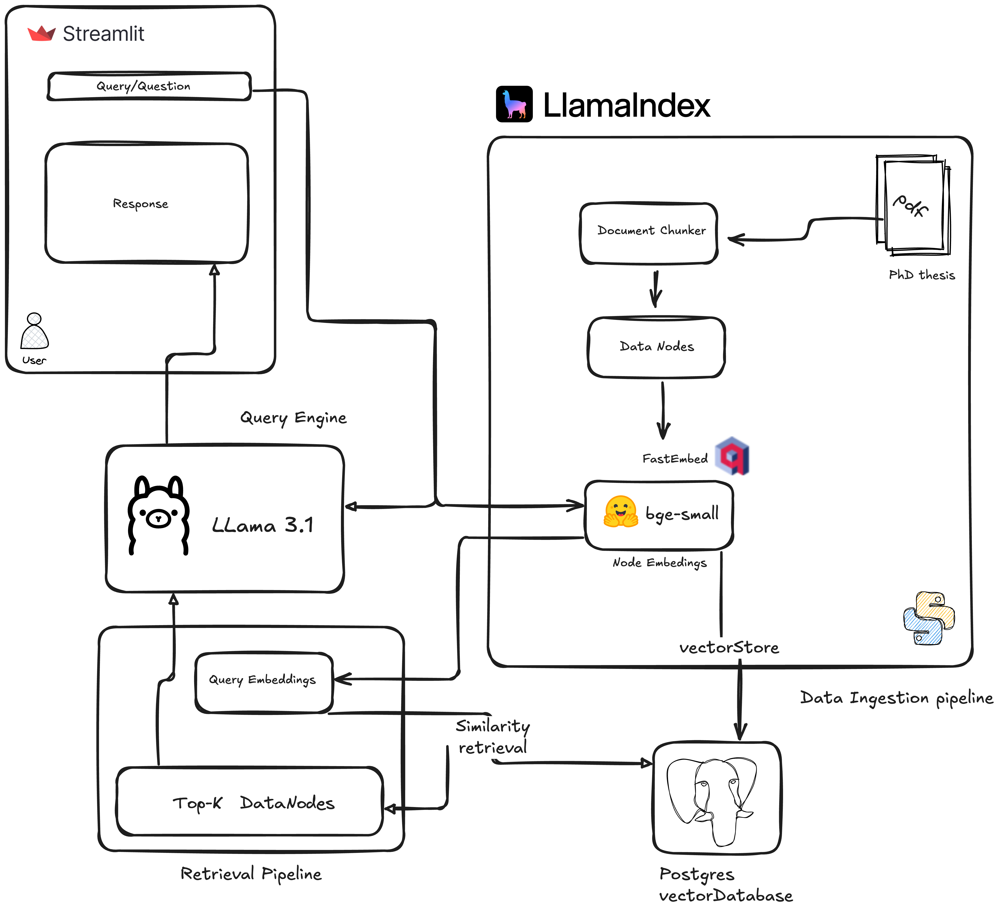

# Thesis RAG

This project implements a Retrieval-Augmented Generation (RAG) pipeline locally for answering questions directly related to my PhD thesis. 

### Purpose
A personalized RAG assistant built with LlamaIndex, Ollama, and Streamlit, designed to help me explore, question, and prepare for my PhD thesis defense. 
    
You can Build a personal research assistant capable of retrieving and explaining complex concepts from you documents

# Pipeline



It combines:

- Document retrieval for efficient access to relevant materials
- Chunking of large texts to manage and process information effectively
- Embedding-based similarity search to identify and connect related content
- Large Language Models (LLMs) for advanced understanding and generation of text
- User interface (UI) for intuitive interaction and seamless workflow


# Architecture and modules
```
THESIS_QA_RAG/
│
├── Config/               # Database & system configurations add your's
│   └── db_config.ini
│
├── RAGPipeline/          # Core RAG components
│   ├── BootPipe.py       # Entry point: initialize RAG pipeline
│   ├── Chunker.py        # Splits thesis into semantic chunks
│   ├── DBConnect.py      # Database connections
│   ├── InitPipe.py       # Initializes embeddings & retrievers
│   ├── NodeEmbedder.py   # Creates vector representations
│   ├── QueryEngine.py    # Handles natural language queries
│   └── Retriever.py      # Finds most relevant chunks
│
├── static/               # Static UI resources
│
├── UI.py                 # Streamlit-based user interface
├── mainAssist.py         # Utilities for interactive assistance
└── README.md             # Project documentation
```

### Installation

##### 1- Clone the project
```
git clone https://github.com/your-username/Thesis_QA_RAG.git
cd Thesis_QA_RAG
```
##### 2- Create venv environment
```
conda create -n rag_env python=3.10
conda activate rag_env
```
##### 3- Install requirements
```
pip install -r requirements.txt
```

##### 4- Create Vector PSQL database
Create a database with a name inside postgressql and update db_config.ini with your configurations
```
[database]
databasename = #database name
host = localhost #host ip 
password = #database password 
port = 5432 #listening port
user = #database user name
table_name = # database table name
```
##### 4- Upload pdf document
1. rename your pdf into **thesis.pdf**
2. upload into **static/pdf/**


#### 5- Interaction
```
streamlit run UI.py
```
Everything runs locally so you, the response generation will vary depending on your hardware

If you find this project intersting, don’t forget to ⭐ the repo!


